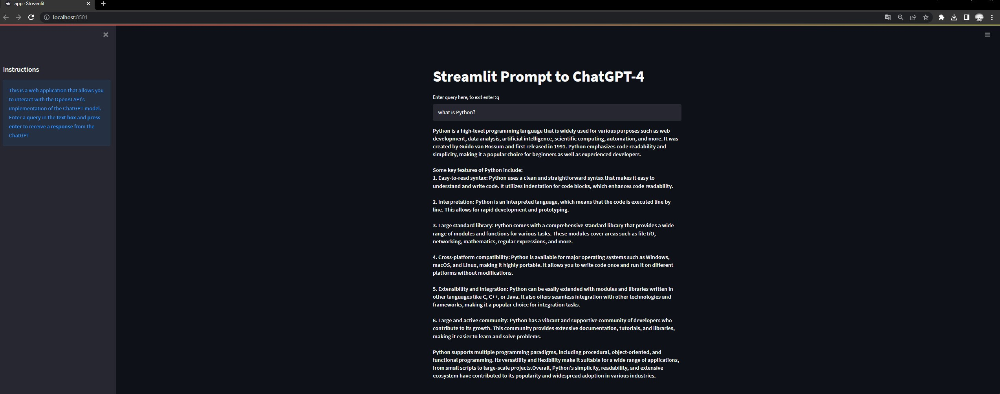
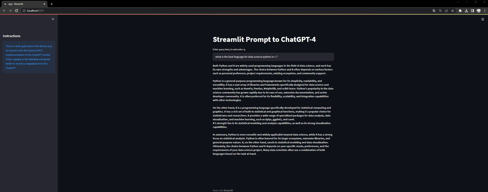

# Streamlit app for GPT4 Prompt
This repository is to share a simple Streamlit prompt ChatGPT-4.   

### Instructions:  
this app run well on python 3.9 or later. 
you need a streamlit installet on your machine or enviroment. 

### Dependencies:  
Please make sure you have python and streamlit installed on your machine 
to run you can open a Terminal CMD and run the following commands: 

### Commands:
pip install -r requirements 
to run: 
streamlit run app.py 

### Applications Screens: 

Screem 1: Sample of Application running!    
 

Screem 2: Sample of Application running!   

  
 
 ### For more Content about Streamlit please contact me or see my channel:
- Youtube Channel: https://www.youtube.com/@devwithdigas  
- Site: www.devwithdigas.com.br  
